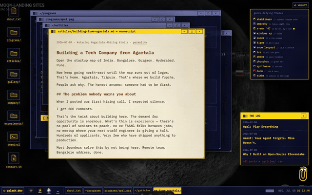
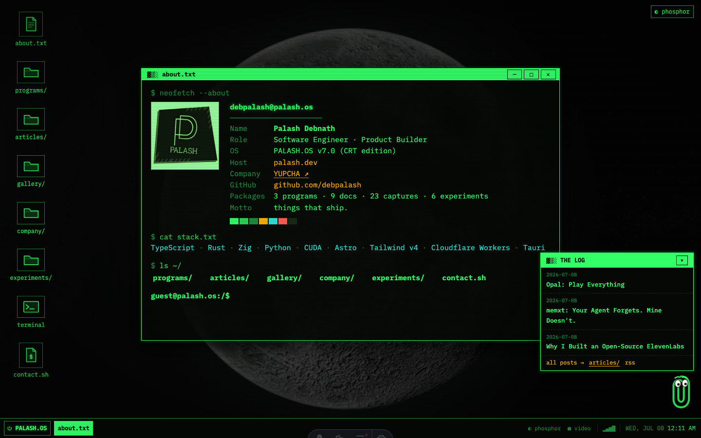

# PHOSPHOR OS — a retro OS portfolio theme for Astro

The source of [palash.dev](https://palash.dev), doubling as a reusable Astro
theme: a 90s operating-system desktop — draggable windows, taskbar, boot
splash, a **working terminal** (`ls`, `cd`, `cat`, `run`, `neofetch`, tab
completion) over a virtual filesystem built from your real content, a
right-click desktop menu switching backgrounds (canvas starfield / 4K
wallhaven wallpapers with slow pan / ambient ISRO mission video), CRT
scanlines — rendered in green phosphor, driven by content collections, with
**zero framework runtime** (window manager + shell are vanilla TypeScript).



<p align="center"><em>theme hopping → percussive maintenance → ⚡ short circuit → shaktimaan.pdf prints anyway</em><br/>
🎬 <a href="docs/demo.mp4">full 45s tour (mp4)</a> — boot → live shell → programs → manuscripts → themes → the printer incident</p>

<details>
<summary>📸 still: the desktop at rest</summary>



</details>

## Stack

- [Astro 7](https://astro.build/blog/astro-7/) (Vite 8 + Rolldown, static output)
- [Tailwind CSS v4](https://tailwindcss.com) for utilities
- [WebTUI](https://github.com/webtui/webtui) for terminal UI primitives (`box-=`, `is-="button"`, theming vars)
- [unpic](https://github.com/ascorbic/unpic-img) image service (`@unpic/astro`) behind Astro's native `<Image>`
- `@astrojs/cloudflare` adapter, deployed on Cloudflare

## Use it as your own

1. Fork / use as template, then `bun install && bun dev`.
2. Edit **`src/site.config.ts`** — your name, OS name, links, boot lines, company info.
3. Fill the content collections:
   - `src/content/products/*.json` — your projects ("programs")
   - `src/content/blog/*.mdx` — your writing ("docs")
   - `src/content/experiments.json` — smaller repos/experiments
   - `src/content/gallery.json` — screenshots (any image URLs)
4. Swap `public/avatar-original.png`, `favicon.svg`, `og-default.png`.

### Theming

Thirteen genre-defying themes ship built-in, switchable from the top-right
corner (persisted per visitor) — **shaktimaan** (default: chakra gold on
crimson), **omarchy**, **x-men '97**, **windows xp**, **paper**, **tiger**,
**snow leopard**, **ice**, **amber**, **phosphor**, **synthwave**, **doom**,
and **simba**. Every color in the OS derives from CSS variables in
`src/styles/global.css`, so adding your own theme is one
`:root[data-theme='yours'] { … }` block plus a button in `Desktop.astro`.

### Anatomy

```text
src/
├── site.config.ts             ← everything personal, one file (incl. background config)
├── styles/global.css          ← Tailwind + WebTUI + phosphor theme + CRT + window chrome
├── scripts/wm.ts              ← vanilla window manager (drag, z-order, taskbar, boot, backgrounds)
├── scripts/terminal.ts        ← shell over the virtual FS (#vfs-data JSON from index.astro)
├── scripts/starfield.ts       ← canvas starfield + meteors
├── layouts/OS.astro           ← head/SEO shell, `mode="os" | "page"`
├── components/os/             ← Desktop, Icon, WindowSrc
├── components/windows/        ← window contents (About, Programs, Docs, …)
└── pages/
    ├── index.astro            ← the desktop
    ├── [slug].astro           ← standalone program pages (deep-linkable)
    └── blog/                  ← standalone doc pages + archive
```

Window contents are server-rendered into hidden `<section class="winsrc">`
nodes; the WM adopts the DOM node into a window frame on open and returns it
on close. Content stays static and SEO-visible, windows cost no hydration.
Anything with `data-open="<id>"` opens a window — including elements inside
other windows. `#<window-id>` in the URL deep-links to a window.

## Commands

| Command       | Action                              |
| :------------ | :---------------------------------- |
| `bun install` | Install dependencies                |
| `bun dev`     | Dev server at `localhost:4321`      |
| `bun build`   | Production build to `./dist/`       |
| `bun preview` | Preview the build locally           |

> Requires Node ≥ 22.15 (Astro 7 / Vite 8 use `module.registerHooks`).
